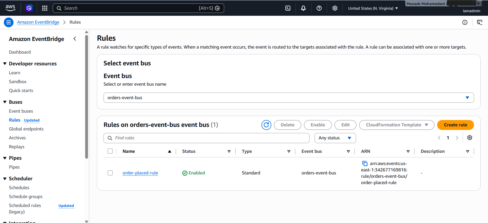
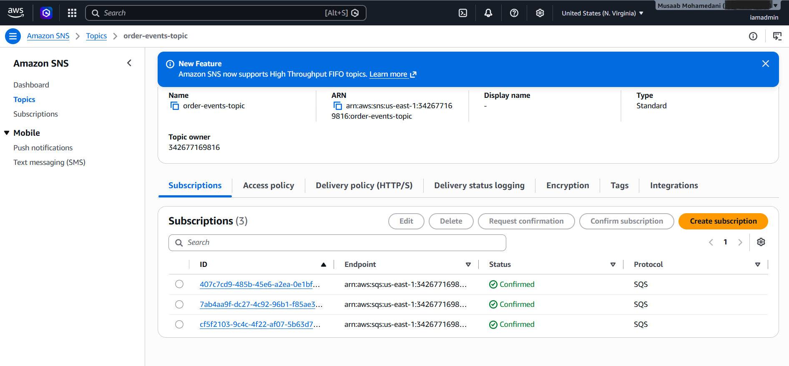
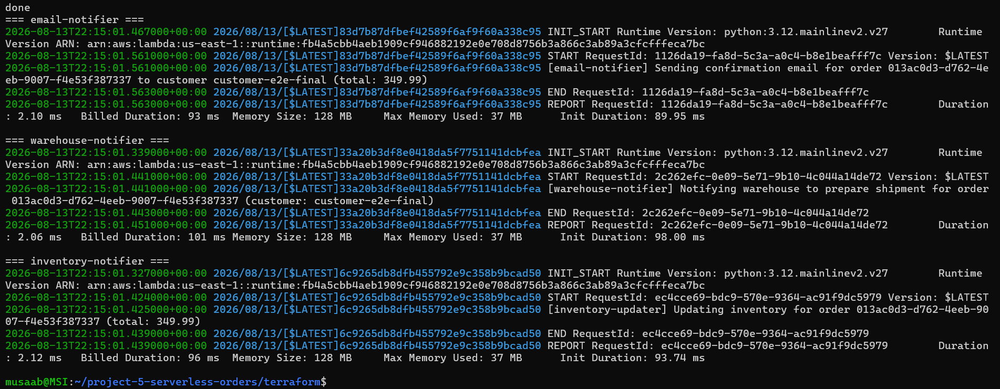
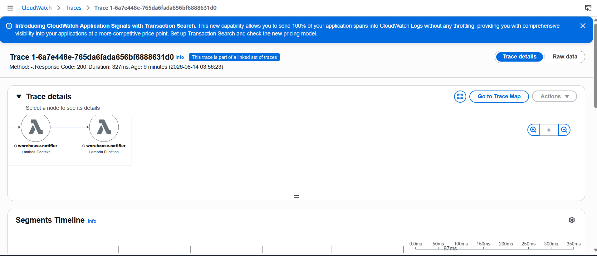

# Serverless Event-Driven Order Platform

A production-style order processing pipeline on AWS — API Gateway and Lambda for the synchronous path, EventBridge/SNS/SQS fan-out for asynchronous, isolated downstream processing. Fully defined in Terraform, with distributed tracing via X-Ray.


## Tech stack

AWS Lambda (Python 3.12) · API Gateway (HTTP API) · DynamoDB · EventBridge · SNS · SQS · X-Ray · Terraform (modular, S3 remote state with native locking)

## Key capabilities

- Public HTTP API to place an order, backed by a Lambda and a DynamoDB table with a GSI for customer-level lookups
- Event-driven fan-out: one order triggers three independent downstream workflows (email, warehouse, inventory) via EventBridge → SNS → SQS
- Failure isolation: each consumer has its own queue and dead-letter queue, so one consumer failing never blocks or slows the others
- Least-privilege IAM throughout — every role scoped to a specific resource ARN, every cross-service trust relationship uses an explicit resource policy
- Distributed tracing via X-Ray on all four Lambdas
- 100% Terraform-defined, deployed and torn down on a strict create → test → verify → destroy cycle every session

## Testing and verification

Real CLI output from a live test, not simulated.

**One order placed via the public API:**

```
$ curl -X POST https://.../orders -d '{"customer_id": "customer-fanout-test", "total_amount": 199.99}'
HTTP/2 201
{"order_id": "e9410a94-259b-433a-b387-413b7ded31cd", "status": "PLACED"}
```

**The same underlying SNS message (MessageId 3e3f5403-8f54-5ea3-8693-36f5eb61c0ed) landed independently in all 3 queues:**

```
email-queue     -> MessageId 3e3f5403... delivered
warehouse-queue -> MessageId 3e3f5403... delivered
inventory-queue -> MessageId 3e3f5403... delivered
```

**All 3 consumer Lambdas processed the same order independently, confirmed via CloudWatch Logs:**

```
email-notifier:      order 013ac0d3-d762-4eeb-9007-f4e53f387337 -> confirmation email
warehouse-notifier:  order 013ac0d3-d762-4eeb-9007-f4e53f387337 -> shipment prep
inventory-notifier:  order 013ac0d3-d762-4eeb-9007-f4e53f387337 -> inventory update
```

This is the actual proof behind the fan-out isolation claim in this README: one publish, three independent deliveries, three independent consumers, verified via real IDs matching across every hop, not inferred from infrastructure existing.

Full stack was destroyed and confirmed gone (`ResourceNotFoundException` on every resource) after every test session — see Deploy/Teardown below.

## API usage

```
POST /orders
Content-Type: application/json

{
  "customer_id": "customer-123",
  "total_amount": 49.99
}
```

Response (201):
```
{"order_id": "<uuid>", "status": "PLACED"}
```

Response on invalid input (400):
```
{"error": "Missing required fields: customer_id, total_amount"}
```

## Problem statement

Most portfolio projects demonstrate always-on compute (EC2, ECS, EKS). This project demonstrates the opposite: an event-driven, serverless order pipeline where nothing runs until a request arrives, downstream processing happens asynchronously and in parallel, and failures in one consumer never affect the others. It simulates a realistic e-commerce order flow: an order is placed, persisted, and then independently triggers email confirmation, warehouse notification, and inventory update workflows.

## Requirements

- Accept order requests over a public HTTP endpoint
- Persist orders durably with the ability to query by both order ID and customer ID
- Notify three independent downstream systems (email, warehouse, inventory) per order, with failure isolation between them
- Guarantee no order event is lost once it reaches EventBridge, even under repeated consumer failure
- Provide distributed tracing across the full request path
- Stay within AWS free-tier costs for portfolio-scale testing (create, test, destroy per session)

## Architecture

**Synchronous path:** `API Gateway (HTTP API)` leads to `order-handler` Lambda leads to `DynamoDB` (orders table, on-demand billing, GSI on customer_id/created_at)

**Asynchronous fan-out path:** `order-handler` also publishes an `OrderPlaced` event to a custom `EventBridge` bus, a rule routes it to an SNS topic, the topic fans out independently to three SQS queues (email, warehouse, inventory), each with its own dead-letter queue, each queue triggers its own consumer Lambda via an event source mapping.

**Tracing:** AWS `X-Ray` active tracing is enabled on all four Lambdas. Within a single Lambda invocation, X-Ray automatically captures sub-segments for downstream AWS SDK calls (DynamoDB writes, EventBridge publishes) with zero code instrumentation required. Async invocations (EventBridge/SNS/SQS-triggered consumer Lambdas) do not share one continuous trace with the originating request — X-Ray links them as related traces rather than propagating a single trace ID across the async boundary.

All infrastructure is defined in modular Terraform (dynamodb, iam, lambda, api-gateway, eventbridge, sns-sqs modules), using S3 remote state with native locking, and reuses conventions established in Projects 1-4 of this portfolio.

## Trade-offs

- **HTTP API over REST API** (API Gateway): about 3x cheaper per request and simpler to configure, at the cost of more limited native X-Ray integration and no built-in request validation; validation was implemented entirely in the Lambda instead.
- **SNS fan-out over direct EventBridge-to-SQS targeting**: adds one extra hop, but is what enables true fan-out isolation; each consumer queue is independent, so a failure in one never blocks or slows the others.
- **`str()` over `Decimal`** for monetary values: simpler for a portfolio scope, but not production-correct; see Possible Improvements.
- **Kept the Terraform-deprecated `hash_key`/`range_key` syntax** over the newer `key_schema` syntax for aws_dynamodb_table, after discovering the replacement has active, documented bugs (including destructive GSI recreation) in the AWS provider. Verified via the provider's GitHub issue tracker rather than assumed.

## Cost considerations

Every service used stays within AWS's free tier at portfolio testing volumes (a handful of requests per session), and nothing was left running between sessions. Actual cost was not independently verified against AWS Cost Explorer or the Billing Console — based on free-tier pricing and the short-lived nature of each session's resources, the realistic cost is effectively $0, but this is an estimate, not a confirmed billing figure.

## Security decisions

- **Every IAM role is scoped** to the specific resource ARN it needs (e.g. order-handler can PutItem/GetItem only on the orders table, not dynamodb:* on "*"); containing blast radius from bugs or compromise to a single resource, not the whole account.
- **Every cross-service trust relationship** (API Gateway to Lambda, EventBridge to SNS, SNS to SQS) uses an explicit resource-based policy with a SourceArn/ArnEquals condition, preventing the confused deputy problem where any caller of that AWS service, not just this specific resource, could invoke or publish.
- **`AWSXRayDaemonWriteAccess`** is the one broad managed policy used; justified because its capability (writing trace telemetry) has no meaningful blast radius even applied broadly, unlike data-access permissions.
- **Terraform state** is stored in a versioned, encrypted S3 bucket with native locking, preventing concurrent-write corruption and enabling rollback if state is ever corrupted.

## Failure scenarios

- **SQS retry and DLQ**: each queue has maxReceiveCount = 3; after 3 failed processing attempts a message moves automatically to its dedicated dead-letter queue rather than retrying forever or being silently dropped.
- **Consumer isolation**: verified live; because each consumer has its own SQS queue subscribed independently to the SNS topic, a failure in warehouse-notifier cannot affect email-notifier or inventory-notifier.
- **Real incident (Day 7)**: mid-apply, a network interruption caused an S3 state upload failure and left 3 SQS queues marked tainted by Terraform (created successfully, but their post-create verification call had timed out). Rather than assume corruption, the incident was diagnosed methodically: verified connectivity, cross-checked terraform state list against real AWS resources, inspected the actual plan diff before touching apply again. Terraform's taint mechanism safely destroyed and recreated the 3 affected (empty, message-free) queues with zero data loss. Full recovery confirmed via a clean terraform plan showing no drift.
- **No ordering guarantee**: SNS and standard SQS queues do not guarantee message order. Two orders from the same customer placed in quick succession are not guaranteed to be processed by consumers in the order they were placed. Not addressed in this implementation; SQS FIFO queues would be the fix if ordering became a requirement.
- **Known limitation — dual-write problem**: the DynamoDB write and EventBridge publish are two separate, non-atomic calls. If the DynamoDB write succeeds but the EventBridge publish fails, the order exists but no downstream consumer is ever notified. The ordering (DB write first) was chosen deliberately so DynamoDB remains the source of truth, but this does not fully solve the problem; see Possible Improvements.

## Lessons learned

- Terraform deprecation warnings do not always mean migrate immediately; verified via the provider's own issue tracker that the suggested replacement (key_schema) had an active bug, and made the informed call to keep the deprecated syntax.
- SQS's failure model is precise: a message is only successful when explicitly deleted, not merely when the Lambda code finishes running without an exception; meaning a crash after real side effects still triggers redelivery and duplicate processing (at-least-once delivery, not exactly-once).
- Proxy integration between API Gateway and Lambda means API Gateway transports, but Lambda alone is responsible for input validation and turning failures into proper 4xx vs 5xx responses.

## Possible improvements

- **Idempotent consumers**: use order_id as an idempotency key (e.g. a DynamoDB conditional write per consumer) to guard against SQS's at-least-once delivery causing duplicate side effects (duplicate emails, duplicate inventory decrements).
- **Partial batch failure reporting**: currently, one bad message in an SQS batch fails the entire batch, redelivering already-successful messages too. AWS Lambda supports reporting which specific message IDs failed; a real fix, not implemented here to keep consumer code simple.
- **Transactional outbox pattern**: to properly solve the DynamoDB/EventBridge dual-write problem, write the event to an outbox table (via DynamoDB Streams) instead of publishing directly from the Lambda; guarantees the event is eventually published if and only if the DB write succeeded.
- **`Decimal` instead of `str()`** for monetary values, enabling numeric queries and aggregations directly in DynamoDB.

## Evidence

**EventBridge rule matching OrderPlaced events**



**SNS topic with all 3 SQS subscriptions**



**A consumer Lambda processing a real order end-to-end**



**A live X-Ray distributed trace**



## Repository structure

```
serverless-order-platform/
├── terraform/
│   ├── main.tf, provider.tf, backend.tf, outputs.tf
│   └── modules/
│       ├── dynamodb/
│       ├── iam/
│       ├── lambda/
│       ├── api-gateway/
│       ├── eventbridge/
│       └── sns-sqs/
├── src/
│   ├── order-handler/
│   ├── email-notifier/
│   ├── warehouse-notifier/
│   └── inventory-notifier/
└── docs/screenshots/
```

## Deploy

```
cd terraform
terraform init
terraform apply
```

## Teardown

```
terraform destroy
```

Every session in this project followed a strict create, test, verify, destroy discipline; no resources were left running between sessions.

## Contact

[LinkedIn](https://www.linkedin.com/in/musaabmohamedan1)
